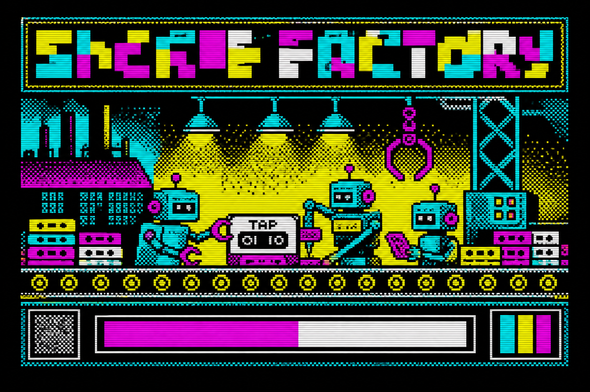

# ZX Spectrum Game Factory



**Free, open-source Cursor harness for building ZX Spectrum games with AI agent teams.**

> **Why does this repo exist?** It is the open-source output of a four-prompt experiment described in [The "Shit Prompt" Method — build AI factories in under 5 minutes](https://alanhemmings.com/posts/2026-08-16-the-shit-prompt-method.html). **Please read that post first** — it explains what was built, what was not, and why the gap analysis is yours to do.

> **Built with AI?** Well, yes. I mean, [read the post](https://alanhemmings.com/posts/2026-08-16-the-shit-prompt-method.html) — I literally published the four prompts. This repo *is* Prompt 3 (scaffold) plus Prompt 4 (that banner). Stating the obvious is optional, but hey. ;)

Turn a game idea into a `.tap` or `.z80` binary by orchestrating specialist agents — producer, Z80 engineer, pixel artist, audio, copywriter, and QA — over reusable engine building blocks.

[](LICENSE)

## What is this?

This repo is a **factory scaffold**, not a finished game. It provides:

- **Cursor rules** (`.cursor/rules/`) — agent personas and role boundaries
- **Agent prompts** (`agents/`) — system prompts for each specialist
- **Engine library** (`engine/`) — modular Z80 / Spectrum building blocks (gfx, audio, input, core)
- **Tooling** (`tools/`) — build scripts and converters (stubs to extend)
- **Emulator integration** (`emulator/`) — run and test builds
- **Game workspace** (`workspace/`) — where each game project lives

Born from the ["Shit Prompt" method](https://alanhemmings.com/posts/2026-08-16-the-shit-prompt-method.html): four prompts — terrible brief, *improve this*, ship the repo, draw the loading screen. **No game has been built with it yet** — see the [blog disclaimer](https://alanhemmings.com/posts/2026-08-16-the-shit-prompt-method.html#disclaimer--read-this-before-you-fork-it). See [FACTORY.md](./FACTORY.md) for the Prompt 2 factory spec.

## Quick start

### 1. Clone and open in Cursor

```bash
git clone https://github.com/goblinfactory/zxspectrum-game-factory.git
cd zxspectrum-game-factory
cursor .
```

### 2. Act as Game Designer

Start a new Agent chat and describe your game:

> A 2D platformer set in a haunted coal mine. Single screen rooms, Kempston joystick, BEEP sound effects.

The **Producer** agent should create a GDD under `workspace/<game-slug>/`.

### 3. Run the pipeline

| Phase | Agent | Output |
|-------|-------|--------|
| Design | Producer | `workspace/<game>/GDD.md`, task breakdown |
| Assets | Pixel Artist, Audio | Sprites, tiles, SFX in `workspace/<game>/assets/` |
| Code | Code Engineer | Game logic using `engine/` blocks |
| Test | QA Tester | Build + emulator run, bug report |
| Release | Copywriter | Manual, loading screen text |

Invoke agents by name or `@` the relevant rule file. See [agents/README.md](./agents/README.md).

### 4. Build (when tooling is wired)

```bash
./tools/build.sh workspace/<game-slug>
```

## Directory layout

```text
.
├── .cursor/rules/     Agent personas (Cursor rules)
├── agents/            Prompts per specialist
├── engine/
│   ├── core/          Game loop, memory, interrupts
│   ├── gfx/           Sprites, tilemap, attribute clash
│   ├── audio/         BEEP / AY-3-8910 drivers
│   └── input/         Keyboard, Kempston, Sinclair
├── tools/             Build & convert scripts
├── emulator/          Test runner setup
├── workspace/         One folder per game project
├── FACTORY.md         Master bootstrap prompt
└── CONTRIBUTING.md
```

## Hardware constraints (non-negotiable)

- **Resolution:** 256×192 pixels
- **Attributes:** 8×8 cell grid, one foreground + one background per cell (attribute clash is real)
- **Screen RAM:** `$4000`–`$57FF` (6912 bytes bitmap + attributes)
- **Targets:** 48K `.tap` / `.z80` first; 128K optional later
- **Formats:** `.tap`, `.tzx`, `.z80` — not modern WASM/HTML5 game engines

Details: [engine/core/MEMORY.md](./engine/core/MEMORY.md)

## Agent team

| Agent | Rule | Responsibility |
|-------|------|----------------|
| Producer | `.cursor/rules/producer.mdc` | GDD, task breakdown, orchestration |
| Code Engineer | `.cursor/rules/code-engineer.mdc` | Z80/asm, engine assembly, memory |
| Pixel Artist | `.cursor/rules/pixel-artist.mdc` | Spectrum-compliant art |
| Audio Specialist | `.cursor/rules/audio-specialist.mdc` | BEEP / AY music & SFX |
| Copywriter | `.cursor/rules/copywriter.mdc` | In-game text, manual, inlay |
| QA Tester | `.cursor/rules/qa-tester.mdc` | Build, emulator, bug reports |

## Status

**Early scaffold — no playable game shipped yet.** Engine blocks and build tooling are stubs. The author has not run this factory end-to-end; that gap analysis is left to you. The value today is the **agent harness and factory prompt** — use Cursor to flesh out `engine/` and `tools/` for your game, and read the [blog post](https://alanhemmings.com/posts/2026-08-16-the-shit-prompt-method.html) for context.

Track progress against acceptance criteria in [FACTORY.md](./FACTORY.md#3-workflow--acceptance-criteria).

## Contributing

See [CONTRIBUTING.md](./CONTRIBUTING.md). PRs welcome for converters, z88dk integration, example games, and tighter Spectrum constraints.

## License

[MIT](./LICENSE) — Copyright (c) 2026 Alan Hemmings / Goblinfactory Ltd

## Links

- Blog: [The "Shit Prompt" Method](https://alanhemmings.com/posts/2026-08-16-the-shit-prompt-method.html)
- Author: [Alan Hemmings](https://alanhemmings.com) · [GitHub @goblinfactory](https://github.com/goblinfactory)
